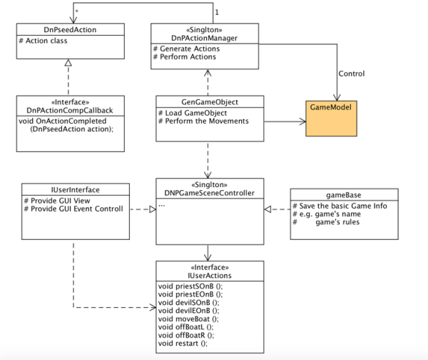

这次改进主要是把对象动作分离出来，用一个ActionManager类来统一管理。动作结束之后，再通过回调来处理后续事件。

动作的管理使用**简单工厂模式**。`DnPseedAction`是动作的基类，继承自`MonoBehaviour`；`ActionManager`为`System.Object`，通过简单给定不同的target，生成不同的`DnPseedAction`并执行，使得代码简洁而易于管理。同时，动作完成之后（`transform.position == target`），再通过回调接口来向`DnPGameSceneController`发送消息。
**UML图**

**修改部分：**
1. 增加了简单工厂模式的类：`DnPseedAction`,`ActionManager`，和接口`DnPActionCompCallback`，均写在`gameBase.cs`中。
2. 简化了枚举类型`State`，变为4个状态： `Moving, Idle, WIN, LOSE`。并相应地在`GenGameObject.cs`中加入变量`boat_side`记录boat的位置。
3. GUI界面，改为当State为Moving时不绘制按钮。从而使得Moving时不接受用户输入。
4. `GenGameObject.cs`对应逻辑的修改。

源码地址：
https://github.com/MarshallW906/homeworkSYSU/tree/master/Unity3DCourse/HW04-DevilNPastor-Optimize
