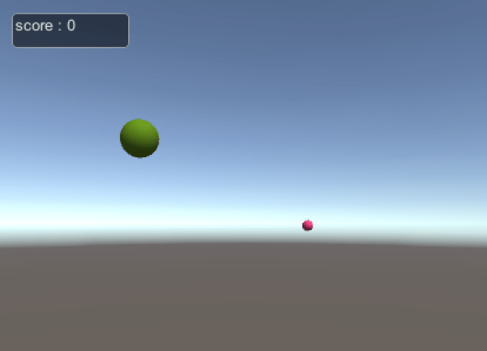
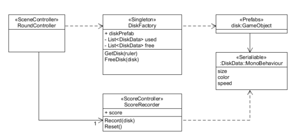

这次是做一个简单的打飞碟游戏。按照老师提供的UML图做即可，思路很清晰。

**有一点与给定的UML图不同，就是我的DiskData类实际上内建了动作，并没有去做序列化。在DiskData类中动作完成之后，通过回调中的对DiskFactory单例的回用完成动作回收。**

首先在场景中制作一个球体，添加类DiskData.cs，写好“飞碟”有的行为逻辑，然后拖动到Assets中成为预制。为了方便起见，给该预制加了tag为"disk"，方便后面作鼠标点击（不过实际上unity5.0之后用Ray检测对象的点击已经不需要如此）。

接下来是分工合作的三个类，直接挂载在摄像机上即可：`RoundController`,`ScoreRecorder`,`DiskFactory`。 `RoundController`负责总管整个游戏的行程（关卡、下一关、重新开始），`ScoreRecorder`负责记录并显示分数，`DiskFactory`负责统一管理“飞碟”的飞行动作，实现动作的使用和收回。

几个类相互通信采用场景类的单例模式写法。
使用也很方便，如`Singleton.Instance`即可获取其单例。
```cs
public class Singleton : MonoBehaviour where T : MonoBehaviour
{
protected static T instance;

public static T Instance {
get {
if (instance == null) {
instance = (T)FindObjectOfType (typeof(T));
if (instance == null) {
Debug.LogError ("An instance of " + typeof(T) + " is needed in the scene, but there is none.");
}
}
return instance;
}
}
}
```

总的来说，只要理解的架构，写起来并不难。后面是每个类的代码。

源码地址：
https://github.com/MarshallW906/homeworkSYSU/tree/master/Unity3DCourse/HW05-DiskShooter

后面一次作业，要求使用物理引擎同样实现飞碟的运动，并且使用Adapter模式，使得可以自由切换其运动的实现方式
https://github.com/MarshallW906/homeworkSYSU/tree/master/Unity3DCourse/HW06-DiskShooter-Plus
