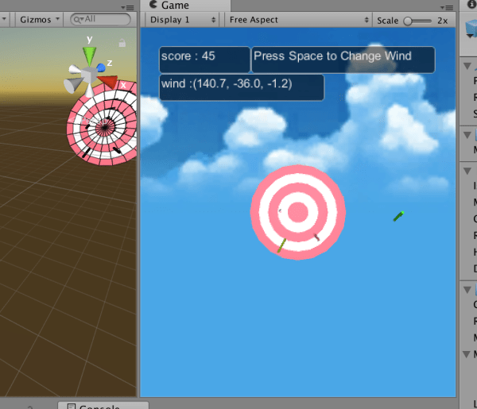
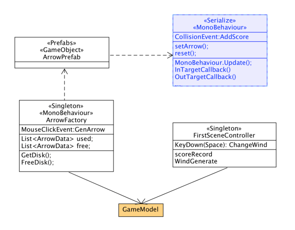

#3d游戏开发 HW6 简单射箭小游戏

##游戏规则
靶对象为5环，按环计分
箭矢中靶之后要插在靶上
游戏仅一轮，无限trials
增强要求：添加一个风向和强度标志，提高难度。

**补充：我使用了随机生成的风向，每中靶一次改变风向，但有时候风向实在太为极端很难中靶，我额外添加了按空格换风向的功能。**

##设计过程：
新建5个Capsule，Collider使用默认添加的Capsule Collider。调整大小使之成为5个环的样式。然后新建`scoreData.cs`，仅一个public属性，为保存该环的分数score。将该cs分别挂载到5个Capsule上。
然后再新建一个Capsule，**添加刚体(Rigidbody)**。调整scale使称为细长状，将Rotate处旋转为水平，并暂时记下该数值（**因为后面用代码创建时，Rotate的属性并不会被记下，需要手动指定。**）。**也需要暂时记下scale的数值。我们是通过在给定坐标手动加外力的方式来模拟重心在箭头的位置。**即`AddForceAtPosition()`。

另外加了一个天空场景的SkyBox，以及给Main Camera加了Light，给靶提供光照。

类的结构设计比较简单。一个ArrowFactory来管理箭矢，一个SceneController来管理分数、风向，以及一个ArrowData为元运动类。碰撞判定直接写在ArrowData中，单击生成箭矢直接写在ArrowFactory中，然后其余的与规则、难度、场控有关的逻辑写在SceneController中。
**我认为这样的好处是各司其职、设计简洁，坏处是扩展性较差。如想要加一个单击事件，再新建一个类处理该事件的话，还需要额外处理与原有事件（单击射箭）的冲突问题。**
UML图：

源码地址：
https://github.com/MarshallW906/homeworkSYSU/tree/master/Unity3DCourse/HW06-ArrowShooter
