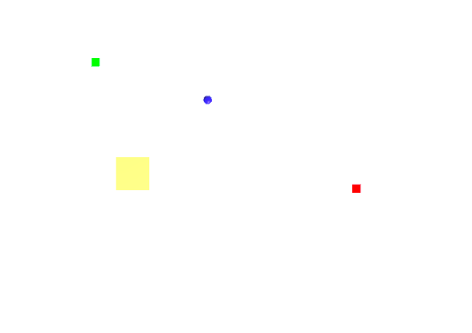

简述
这次作业是实现一个巡逻兵的Demo。**必须用到订阅-发布模式处理事件**
具体要求是：
1. 创建一个地图和若干巡逻兵；
2. 每个巡逻兵走一个3~5个边的凸多边型，位置数据是相对地址。即每次确定下一个目标位置，用自己当前位置为原点计算；
3. 巡逻兵碰撞到障碍物如树，则会自动选下一个点为目标；
4. 巡逻兵在设定范围内感知到玩家，会自动追击玩家；
5. 失去玩家目标后，继续巡逻；
6. 计分：每次甩掉一个巡逻兵计一分，与巡逻兵碰撞游戏结束；

为了专注于游戏逻辑本身（主要是 总是会在前端的东西上花过多时间，索性完全抛开），我只做了游戏原型。游戏中，蓝色圆点代表玩家，小的正方形代表巡逻兵，大的正方形代表障碍物。
**这里我对作业的要求做了一点小的改动：我令每次甩掉一个巡逻兵之后，该巡逻兵速度越快，则加分越多；每个巡逻兵只会追逐玩家一次，并且只能加一次分，加过分之后会由红色变为绿色；全部巡逻兵的分数都获得了之后，游戏成功。（考虑之后再改回去：实际上只是修改一下回调函数的逻辑，只有几行代码的增删）**

类的结构
一个用于MonoBehaviour的单例类。
一个巡逻兵的`MonoBehaviour`类，一个与之关联的工厂类，一个方便设置和保存巡逻兵参数的可序列化类；
一个**专门处理事件处理逻辑**的`public static partial class GameEvents.cs`。
以及一个`SceneController`，和一个自动生成3~5凸多边形路径的类。各个类之间的结合关系明了，UML图略。

Step by Step
**一、制作Prefab（非代码部分）**
思路很简单，需要一个Collider来检测碰撞，若碰撞触发，则触发对应事件：游戏结束的逻辑。
同时需要一个距离检测，当Player与巡逻兵在一定距离之内时，触发对应事件：巡逻兵开始追逐Player。
用**内外两个Collider**即可解决。内部为Collider碰撞器，外部为Trigger触发器。
创建一个Cube，增加组件`Sphere Collider`，并勾选`is Trigger`。原有的Box Collider保持不变即可。调整Cube的大小，和**Sphere Collider**的半径到自己满意的程度。我的选择是，Cube大小保持不变，Trigger半径（Radius）为5。

然后将该Cube拖入Assets中，将生成的Prefab命名为`PatrolSolider`。然后就可以删除在Hierarchy中的Cube了。

二、巡逻兵本体的代码： SPatrol.cs, SPatrolData.cs
选中上一步生成的Prefab，在Inspector面板中Add Component→New Script。命名为`SPatrol.cs`然后编辑。
（为了读起来方便，**代码全部放在文末**。这里主要说一下思路）
属性部分，需要的属性是**isEnabled、速度、巡逻路线的顺序点集、是否已发现Player、Player的位置**，以及**三种情况下的回调函数声明。**
三种情况分别是：巡逻兵发现Player、巡逻兵与Player相撞、巡逻兵被Player甩开。
代码中，许多函数的**返回值是SPatrol本身的类型**，主要是为了**实现链式调用**，简化外部代码。

三、3~5凸多边形的生成 RectGenerator.cs
这里感谢老师的提示。这个方法真的是简单方便：先随机生成矩形，然后在每条边上随机取点即可。
详细一点来说就是，先随机生成一个按顺序连接可构成矩形的四个点，然后按顺序在每两个点之间随机取点，即可获得凸多边形。**很容易理解，如果是按照该方法来获得多边形，最多可以获得凸八边形。**

PS：写博客的时候突然想到的，任意凸多边形的生成方式：
先以随机某点为圆心，任意生成**圆或者椭圆**，然后在圆（椭圆）上**按顺时针或逆时针方向取点**，直到**取满360°**即可。用三角函数就可以直接实现。可以很方便的生成**等边凸多边形**；若是不等边，则每次取点的时候对**旋转角度随机（控制总和不超过360°）**即可。

**四、订阅与发布模式：事件产生 和 事件处理的代码的分离**：GameEvents.cs
在这次作业中，巡逻兵是所有事件的感知和产生者。而对一个事件做出反应的东西往往有很多个。这种时候，将事件的感知和处理逻辑写在一起，**是一种很难以维护的方式。**
因为对于这个游戏来说，事件逻辑已经足够简单，所以**发布者和订阅者都可以简化成一个**：发布者是每个巡逻兵，订阅者是`SceneController`。所以在通过这部分代码理解发布订阅模式时，**多方订阅**的部分可能需要自己继续想象。

**比较典型一点的构造应当是：**多个订阅者拥有自己的对同一类事件的各自的事件处理逻辑（写在自己的代码中，比如写在自己的类里，并且不可被外部访问），然后在每个订阅者实例化的时候，向**一个专门负责事件发布与接收的地方**注册自己的事件处理函数（回调函数），然后发布者在感知并产生事件之后，向**同样的负责事件分发的地方传送自己的事件**，然后该事件依次进入不同订阅者的逻辑中，实施其自己的工作。

**我的这部分代码，简化了事件分发的逻辑，直接用了一个static类把事件处理逻辑写在了上面，实际上并不完全是上面说的结构。**

**五、巡逻兵工厂类和SceneController**
工厂模式和场记管理类，在这门课程最早的几次课中就已经学习过了，这里不多赘述。
这里的场记类只负责了记分与重新开始。

本部分源码地址：https://github.com/MarshallW906/homeworkSYSU/tree/master/Unity3DCourse/HW07-PatrolDemo