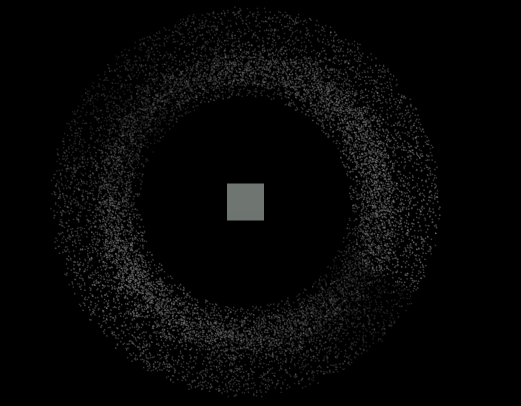
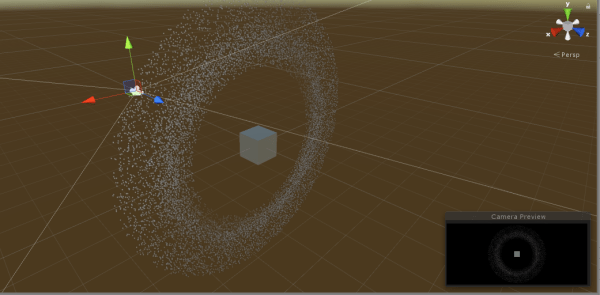
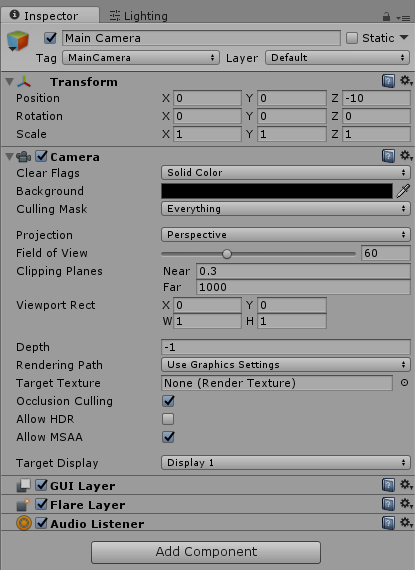
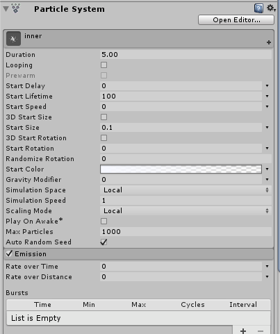
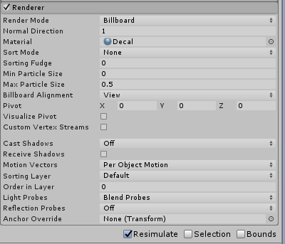
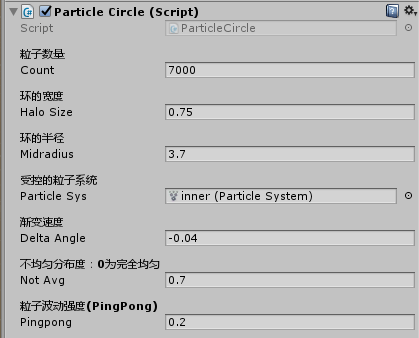
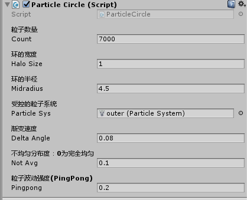

##简述
这次作业是做一个如[这个网站](http://i-remember.fr/en)开场的环形粒子效果。主要是用Particle System.

下图为我的实现效果。为了方便直观地确定旋转中心，我在最中央放了一个Cube。

主要是用到Unity的粒子系统，以及一些与圆、旋转有关的代码。
图为在Scene中看到的运行时效果。

##详解
新建Project，新建场景。删去Directional Light，然后设置主摄像机为正交投影模式，并且设置背景等属性。如下图。

然后新建空的GameObject，命名为`DuoCircleSystem`。我们的粒子效果在这下面通过**两个类似的环形粒子效果配合实现**。所以我们需要做的是，完成其中一个，然后复制一份，然后修改复制出的那份的一些参数（半径、粒子个数、粒子分布均匀程度等）即可。

在DuoCircleSystem下面继续创建空的GameObject，起名为inner，然后Add Component→Particle System。
然后对ParticleSystem进行一番设置：粒子材料选用的是上课老师提供的Explosion Pack Fx中的Decal。

然后同样的方式，为其添加一个脚本。脚本名为`ParticleCircle.cs`，然后编辑脚本。
代码大概百行，关键在于理解每个部分的内容。
关键点是：**按照圆形分布、旋转、粒子位置的不均匀分布、粒子透明度的不均匀分布**
圆形主要是用三角函数实现；
粒子位置的不均匀分布：通过分段Random实现。代码中注释足够看懂，不必多说。

ParticleCircle.cs保存之后，记得把ParticleSystem用鼠标拖动到这个脚本的【受控的粒子系统】处。
CirclePosition.cs单独创建出来，无需挂载。

添加完之后，按Ctrl+D复制inner对象，命名为outer。
最后是调整参数。费心思调整一番之后，终于得到了如上图所示的，与那个网站类似的效果，不过还是有一些欠缺。
下面给出我的两组参数，分别设置到inner和outer中即可：

代码统一放在我的Github上： https://github.com/MarshallW906/homeworkSYSU/tree/master/Unity3DCourse
本部分源码地址：https://github.com/MarshallW906/homeworkSYSU/tree/master/Unity3DCourse/HW09-PariticleSystem
